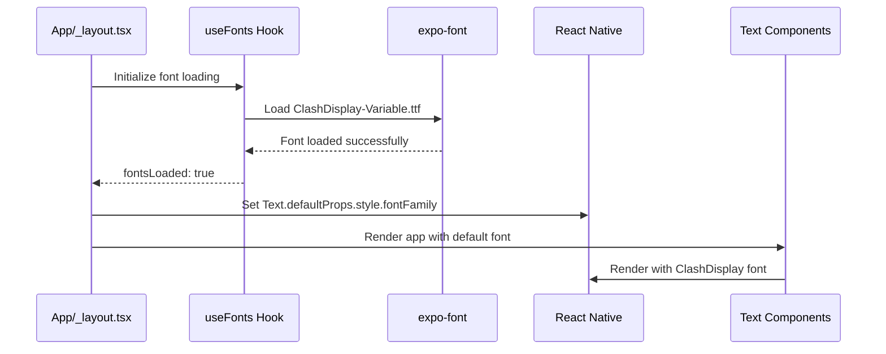

# Design Document

## Overview

This design implements ClashDisplay-Variable.ttf as the default font family for the React Native/Expo application. The solution leverages Expo's font loading capabilities and React Native's global text styling to ensure all Text components use ClashDisplay by default while maintaining flexibility for custom font overrides.

## Architecture

The implementation follows a three-layer approach:

1. **Font Registration Layer**: Uses expo-font to load and register the ClashDisplay-Variable.ttf font
2. **Global Styling Layer**: Configures React Native's default text styling to use ClashDisplay
3. **Component Integration Layer**: Updates ThemedText component to work seamlessly with the new default font

## Components and Interfaces

### Font Loading Service

**Location**: `hooks/useFonts.ts`

```typescript
interface FontLoadingResult {
  fontsLoaded: boolean;
  fontError: Error | null;
}

export function useFonts(): FontLoadingResult;
```

**Responsibilities**:

- Load ClashDisplay-Variable.ttf using expo-font
- Handle loading states and errors
- Provide loading status to components

### Global Text Configuration

**Location**: `app/_layout.tsx` (Root Layout)

**Responsibilities**:

- Set global Text component defaults using React Native's Text.defaultProps
- Apply ClashDisplay as the default fontFamily
- Ensure font is loaded before rendering the app

### Enhanced ThemedText Component

**Location**: `components/ThemedText.tsx`

**Modifications**:

- Remove explicit fontFamily declarations to inherit global default
- Maintain existing type-based styling (fontSize, fontWeight, etc.)
- Preserve color theming functionality
- Support fontFamily override when explicitly provided

## Data Models

### Font Configuration

```typescript
interface FontConfig {
  ClashDisplay: any; // Font resource from require()
}

interface TextStyle {
  fontFamily: string;
  fontSize?: number;
  fontWeight?: string;
  lineHeight?: number;
}
```

## Error Handling

### Font Loading Failures

1. **Network/File Issues**: If ClashDisplay-Variable.ttf fails to load, the app will fallback to platform defaults
2. **Platform Compatibility**: Unsupported platforms will gracefully degrade to system fonts
3. **Loading States**: Display appropriate loading indicators while fonts are being loaded

### Fallback Strategy

```typescript
const defaultFontFamily = Platform.select({
  ios: "System",
  android: "Roboto",
  web: 'system-ui, -apple-system, BlinkMacSystemFont, "Segoe UI", sans-serif',
  default: "System",
});
```

## Testing Strategy

### Unit Tests

1. **Font Loading Hook Tests**

   - Test successful font loading
   - Test error handling scenarios
   - Test loading state management

2. **ThemedText Component Tests**
   - Verify default font application
   - Test font override functionality
   - Validate style inheritance

### Integration Tests

1. **App Startup Tests**
   - Verify fonts load before first render
   - Test fallback behavior when fonts fail
   - Validate no FOUT/FOIT issues

### Platform Tests

1. **Cross-Platform Validation**
   - Test font rendering on iOS simulator
   - Test font rendering on Android emulator
   - Test font rendering on web browser

## Implementation Flow



## Configuration Changes

### app.json Updates

Add font assets configuration:

```json
{
  "expo": {
    "assetBundlePatterns": ["assets/fonts/*"]
  }
}
```

### Global Text Styling

Apply default font family to all Text components:

```typescript
import { Text } from "react-native";

// Set global default
Text.defaultProps = Text.defaultProps || {};
Text.defaultProps.style = { fontFamily: "ClashDisplay" };
```

## Performance Considerations

1. **Font Loading**: ClashDisplay-Variable.ttf will be loaded once during app initialization
2. **Bundle Size**: Font file will be included in the app bundle, increasing initial download size
3. **Memory Usage**: Font will be cached in memory for the app session
4. **Rendering Performance**: No impact on text rendering performance after initial load
